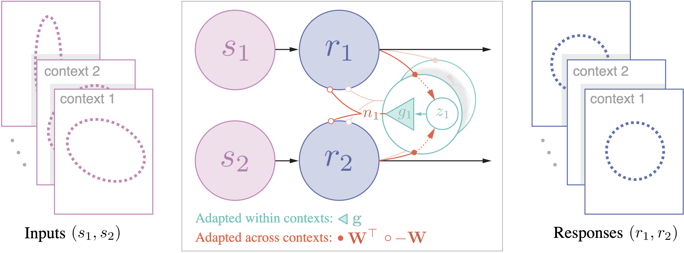

# Adaptive whitening with fast gain modulation and slow synaptic plasticity

## Introduction

This repo is associated with our project on adaptive (i.e. context-dependent) whitening using concurrent gain modulation and synaptic plasticity [1]. The work here builds on our previous work on adaptive whitening using gain modulation with an overcomplete basis [2].

## Code to reproduce figures and experiments

 The `figures/` directory contains ipynb files with simulations from the paper.

## References

[1] [Duong L. R., Simoncelli E. P., Chklovskii D. B., & Lipshutz, D. (2023). Adaptive whitening with fast gain modulation and slow synaptic plasticity. _Neural Information Processing Systems (NeurIPS -- Spotlight)_, New Orleans, LA, USA.](  
<https://doi.org/10.48550/arXiv.2308.13633>)

[2] [Duong L. R.\*, Lipshutz D.\*, Heeger D. J., Chklovskii D. B., & Simoncelli E. P. (2023). Adaptive whitening in neural populations with gain-modulating interneurons. _International Conference on Machine Learning (ICML)_, Honolulu, HI, USA.](  
<https://doi.org/10.48550/arXiv.2301.11955>)
